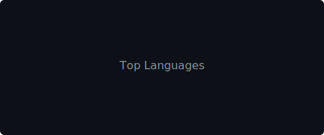

# 今何求 jhq223

  

---

### 👋 About

Rust developer focused on systems programming, CLI tools, and developer tooling.

- 🦀 Mostly writing **Rust** — CLI tools, libraries, and systems programming
- 🐍 **Python** for quick tooling
- 🌐 **SvelteKit** when I need a web frontend

---

### 🛠 Tech Stack

  
  &nbsp;
  
  &nbsp;
  

---

### 📊 Stats

<table align="center">
  <tr>
    <td>
      <picture>
        <source media="(prefers-color-scheme: dark)" srcset="img/stats-dark.svg" />
        
      </picture>
    </td>
    <td>
      <picture>
        <source media="(prefers-color-scheme: dark)" srcset="img/langs-dark.svg" />
        
      </picture>
    </td>
  </tr>
</table>

  <picture>
    <source media="(prefers-color-scheme: dark)" srcset="https://streak-stats.demolab.com?user=jhq223&theme=dark&hide_border=true&background=00000000" />
    
  </picture>

---

### 🐍 Contribution Snake

<picture>
  <source media="(prefers-color-scheme: dark)" srcset="https://raw.githubusercontent.com/jhq223/jhq223/output/github-contribution-grid-snake-dark.svg" />
  <source media="(prefers-color-scheme: light)" srcset="https://raw.githubusercontent.com/jhq223/jhq223/output/github-contribution-grid-snake.svg" />
  
</picture>

---

  

